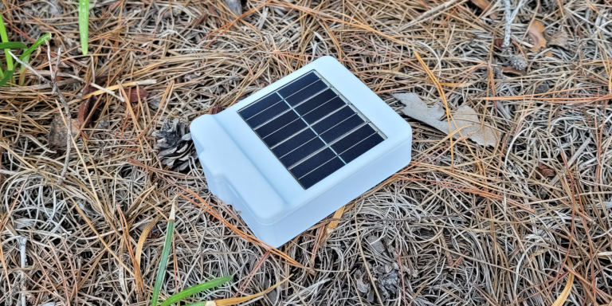
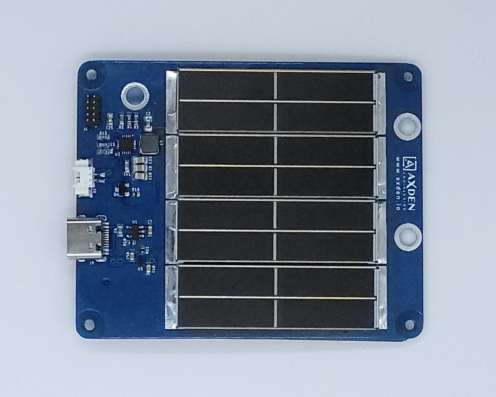
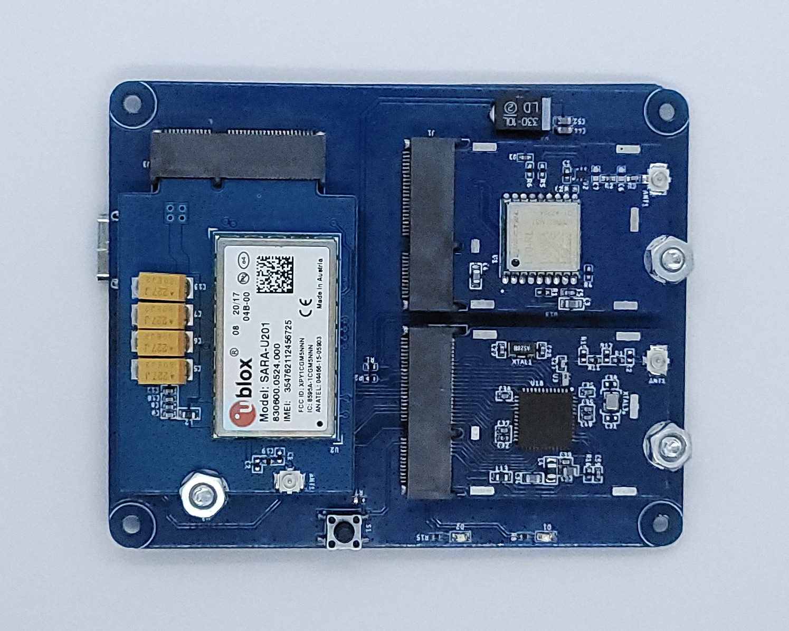
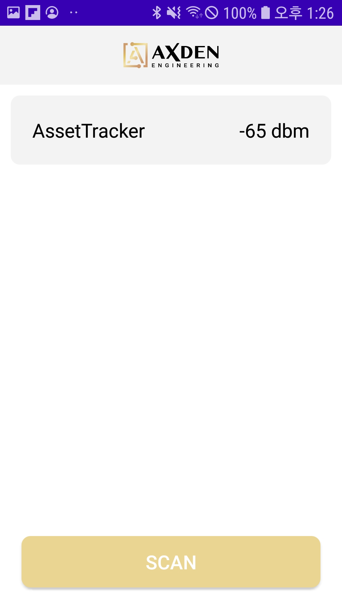
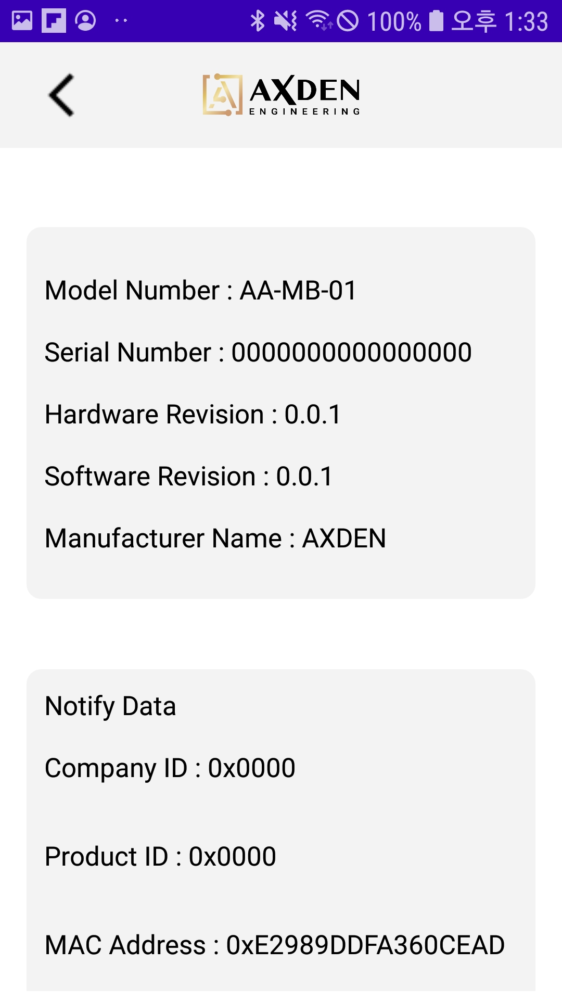
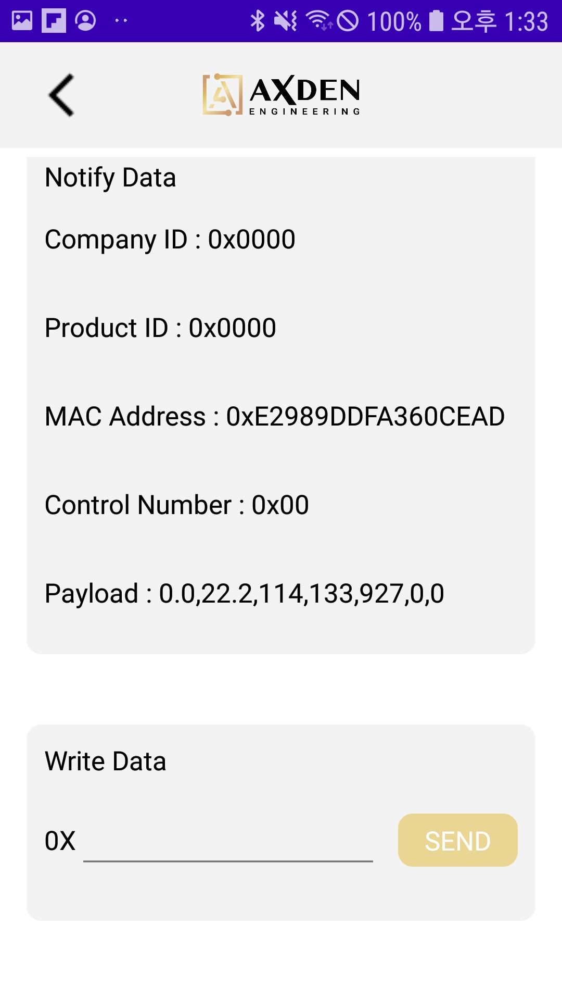
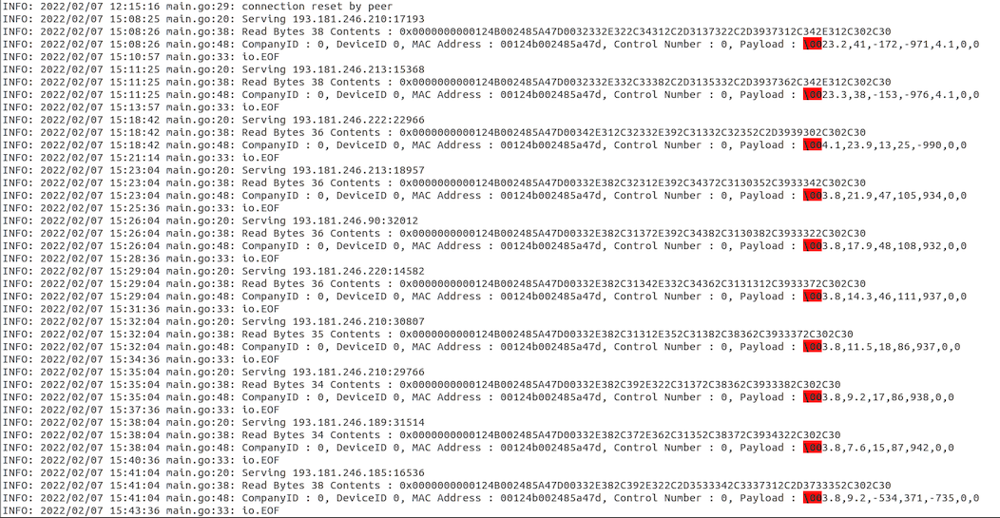
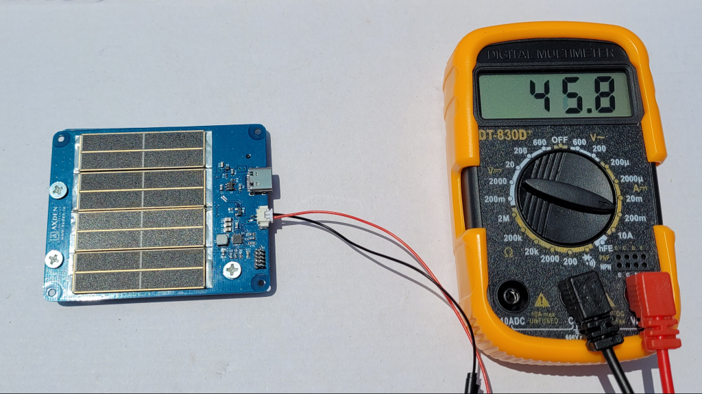
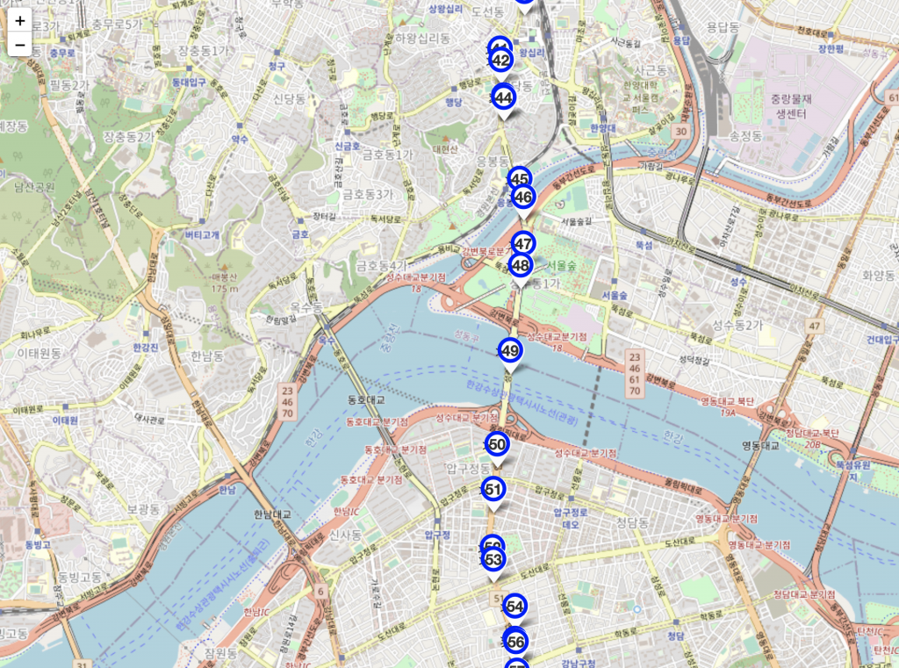

# Bluetooth Solar Power Asset Tracker example

-------------------------

<table>
<tr>
<tr align="center">
  <td>TOP</td>
  <td>BOTTOM</td>
</tr>
  <tr align="center">
    <td></td>
    <td></td>
  </tr>
</table>

-------------------------

Bluetooth Solar Power Asset Tracker 은 AxDen 의 Aggregator Platform 를 이용하여 온도, 가속도, GPS 위치와 같은 Asset tracking 에 필요한 핵심적인 정보를 수집하고 태양광 충전을 이용하여 배터리를 충전합니다.
 
Android, iOS, Aggregator 통신 또는 2G/3G/4G 통신이 필요한 다양한 서비스 시나리오를 빠르게 테스트 할 수 있도록 제공하는 예제입니다.
 
 
Bluetooth Solar Power Asset Tracker uses AxDen's Aggregator Platform to collect key information required for asset tracking such as temperature, acceleration, and GPS location.
 
This is an example that provides quick testing of various service scenarios that require Android, iOS, Aggregator communication or 2G/3G/4G communication.
 

네이버 스마트 스토어에서 구매 가능합니다.
 

[네이버 스마트 스토어](https://smartstore.naver.com/axden)
 

-------------------------

### Bluetooth Solar Power Asset Tracker 의 주요 특징 및 기능

MCU | 설명
:-------------------------:|:-------------------------:
NRF52832 | BLE 5.0 / 5.1 / 5.2 / 5.3

센서 | 설명
:-------------------------:|:-------------------------:
BMA400 | 3-Axis acceleration sensor
SI7051 | temperature sensor
L70 | GPS sensor
NEO-M8N | GPS sensor
BG95/96 | 4G (LTE-M, Cat-M1)
SARA-U2 | 2G, 3G
SPV1050 | Solar battery charger (Max charge current 80mA)
Solar | On board
Battery | 3.7V Lithium Battery

Bluetooth Solar Power Asset Tracker 예제는 온도, 가속도, GPS 위치와 같은 Asset tracking 에 필요한 핵심적인 정보를 수집하고 태양광 충전을 이용하여 배터리를 충전합니다.
 
Sub-G 또는 2G/3G/4G 통신으로 수집된 정보를 전송합니다.
 
 
AxDen Aggregator Platform 과 연동하여 서버, DB 와 같은 인프라 구축 없이 Web 과 Mobile 에서 센서 정보를 확인합니다.
 
 
AxDen Aggregator Platform 에 저장된 센서 정보를 이용하여 Edge AI 를 학습시킵니다.
 

-------------------------

### Android Application

<table>
  <tr align="center">
    <td> </td>
    <td> Android </td>
    <td> </td>
  </tr>
  <tr align="center">
    <td></td>
    <td></td>
    <td></td>
  </tr>
</table>

-------------------------

### 서버를 이용한 확인 방법

TCP 서버가 있다면 서버를 통해 확인이 가능합니다.
 

해당 예제에는 AxDen 에서 제공하는 예제 서버의 IP 와 Port 번호가 임시로 지정되어 있습니다.

<table>
  <tr align="center">
    <td>RF RX 2G/3G/4G Server example log</td>
  </tr>
  <tr align="center">
    <td></td>
  </tr>
</table>

-------------------------

### Solar battery charge 확인 방법
아래 이미지와 같이 멀티미터를 이용하여 태양광을 이용한 배터리 충전 전류량을 확인할 수 있습니다.
 

-------------------------

### AxDen Aggregator Platform 을 이용한 확인 방법
AxDen Aggregator 홈페이지에서 회원 가입 후 기기의 MAC Address 를 등록합니다.
 
AxDen Aggregator 홈페이지에서 제공하는 COMPANY ID, DEVICE ID 를 Protocol.h 파일의 COMPANY_ID, DEVICE_ID 에 입력합니다.
 
 
`#define COMPANY_ID 0`
 
`#define DEVICE_TYPE 0`
 
 
컴파일 후 플래싱을 합니다.
 
 
COMPANY_ID, DEVICE_ID 가 정상적으로 적용되었는지 확인합니다.
 
 
아래 이미지처럼 센서 정보를 Web 또는 Mobile 에서 확인할 수 있습니다.
 
 

-------------------------

### 서버 변경
bg96.c 파일의 `bg96_tcp_data_upload` Function 의 `set_bg96_socket_connect` Function 에서 IP, Port 변경이 가능합니다.
 
sara_u2.c 파일의 `sara_u2_tcp_data_upload` Function 의 `set_sara_socket_connect` Function 에서 IP, Port 변경이 가능합니다.

-------------------------

### 센서 교체
protocl.h 파일에서 센서 교체가 가능합니다.
 

-------------------------

### Note
 

Works with SoftDevice S132 v7.2.0, provided with SDK 17.1.0.
 

To compile it, clone the repository in the [SDK]/examples/ble_peripheral folder.

-------------------------

### [SDK Download](https://github.com/AxDen-Dev/NRF52_Ping_pong_example)

-------------------------

### [Project import](https://github.com/AxDen-Dev/NRF52_Ping_pong_example)

-------------------------

### [Eclipse setting](https://github.com/AxDen-Dev/NRF52_Ping_pong_example)
